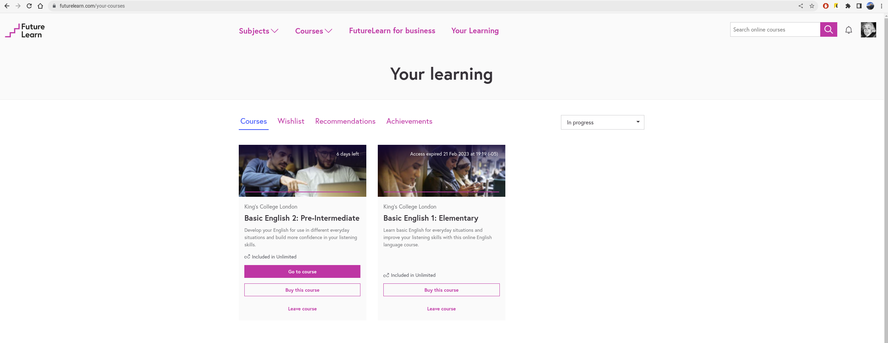

# Basic English 1: Elementary King's College London

***
## Niveles completados

1. Basic English 1: Elementary (2023-02)
2. Basic English 2: Pre-Intermediate (2023-03)

***

Curso: [FutureLearn](https://www.futurelearn.com/)

## Tabla de pronombres

| Subjet Pronouns | Object Pronouns | Possessive Adjetives | Possessive Pronouns | Reflexive Pronouns        |
|-----------------|-----------------|----------------------|---------------------|---------------------------|
| I/YO            | ME/A MI         | MY/MI                | MINE/MIO            | MYSELF/YO MISMO           |
| YOU/TU          | YOU/TU          | YOURS/TUS            | YOURS/TUYO          | YOURSELF/TU MISMO         |
| HE/ÉL           | HIM/A ÉL        | HIS/SUS              | HIS/SUYO            | HIMSELF/ÉL MISMO          |
| SHE/ELLA        | HER/ A ELLA     | HER/SUS              | HER/SUYO            | HERSELF/ELLA MISMA        |
| IT/ESO          | IT/A ESO(A)     | ITS/SUS              | ITS/(NO EXISTE)     | ITSELF/ESO MISMO          |
| WE/NOSOTROS     | US/ A NOSOTROS  | OUR/NUESTRO          | OURS/NUESTRO        | OURSELVES/NOSOTROS MISMOS |
| YOU/USTEDES     | YOU/A USTEDES   | YOURS/SUS            | YOURS/SUYOS         | YOURSELVES/USTEDES MISMOS |
| THEY/ELLOS      | THEM/A ELLOS    | THEIR/SUS            | THEIR/SUYO          | THEMSELVES/ELLOS MISMOS   |

## Adjetivos demostrativos

* There is/are lot- Hay (hay muchos)
* There - Allá
* That - Eso (singular)
* Those - Esos (plural)
* This - Este
* These - Estos

## verbo to be

* am - i am
* is - he/she is
* are - we/you/they are

## Adjetivos/atributos (Adjectives)

tamaño,forma,color,temperatura, sabor

## CONTRACCIONES (Contractions)

he/she is

* he's happy, she's funny
* What’s he like?
* He's/She's not shy

## Hacer Preguntas (asking questions)

### Estructura

1. WHQuestion + to be + sujeto + sustantivo + ?
2. Can + sujeto + verbo + complemento + ?
3. Can + sujeto + do + complemento + ?
4. Could + sujeto + verbo en infinitivo + complemento + ?
5. Could + sujeto + do + complemento + ?

**Could** es mas educado que **Can**.

1. An *offer* es cuando le preguntas a alguien si le gustaría tener algo o si le gustaría que hicieras algo por esapersona.
2. A *request* es cuando le pides a alguien que haga algo por ti.

| **Questions**| **Ejemplo**       	|
|----------------	|-----------------------	|
| Who? / Quien   	| Who is he?            	|
| When? / Cuando 	| When is the exman?    	|
| What? / Qué    	| What is that?         	|
| Why? / Por que 	| Why are you walking?  	|
| Where? / Donde 	| Where is your laptop? 	|
| Which? / Cúal  	| Which is your house?  	|
| Can? / Puede/Puedo | Can I help you?|
| Can? (do) / Puede/Puedo | Can I do this  is on the phone?|
| Could? / Podria | Could you repeat the cuestion, please?|
| Could? (do) / Podria | Could I do this on the phone, please?|

### Ejemplos

1. What's your surname?
2. What's your date of birth?
3. What's your passport number?
4. Can I help you?
5. Could I do this on the phone?
6. Could you spell that for me, please?
7. Could you repeat the question, please?
8. Could you say that again, please?

### Ejemplos offers

1. Would you like something to drink?
2. Would you like me to open the door?
3. Can I help you?
4. Can I give you a hand?
5. Let me help you.
6. Would you like me to answer the phone?
7. Do you want some more tea?
8. Do you want me to turn down the TV?
9. I’d happy to take you to the airport.
10. May I offer you a cup of coffee.

### Ejemplos requests

 1. Can you give me the book?
 2. Could you please take off your raincoat?
 3. Could you please take me to the dentist?
 4. Would you mind opening the window for me, please?
 5. Would you be kind enough to repair my computer?
 6. Do you think you could take me to the supermarket?
 7. Could I ask you to take me home?
 8. Can you tell me what happened?
 9. Would you come to my birthday party?
10. Would it be possible for you to come here at 8 A.M?

## EXPRESIONES (Expressing likes and dislikes)

*(+) Love, like, dontlike, hate (-)*

*sujeto + (dont)+ like + verbo-ing + complemente*
i like reading books
i dont like playing basketball

## fuerte like y dislike (Expressing strong likes and dislikes)

i love reading books
i hate playing basketball

## Preguntas

*Do + subejo + like + verbo-ing + complemento + ?*
P: Do you like playing football?
R: Yes, I do. / Yes, I love playing /  Yes, I like playing
R: No, I dont. / Yes, I hate playing / Yes, I dont like playing

## Interrogativo sobre mas informaciónb

*What kind of + sustantivo + do + sujeto + like + verbo-ing?*

P: What kind of - books - do you like?
P: What kind of music do you like?
P: What kind of a film is this?
P: What kind of films **does** she hate?
R: I like fantasy books
R: I like rock music
R: This is an action film
R: She **hates** watching romantic films

## FUTURO

## Will

Futuro simple, Predicciones en el futuro, Promesas, solicitudes, rechazos, ofertas.

## Shall

Muy formal, menos usado.

# Be going to

Planes e intenciones, Predicciones.

## Positivo

* I will tell you tomorro
* I'll tell you tomorro
* We are going travel the next week
* We gonna travel the next week

## Negativo

* I will not call you tomorro
* I won't call you tomorro
* He’s not going to want this car

## Interrogativo

* Will you come tonight?
* Are you going to London this summer?

## PRESENTE CONTINUO (present continuous tense)

Sujeto + tobe + verbo-ing

## Positivo

* I am reading / I'm reading
* He is reading / He's reading
* You are reading / She's reading

## Negativo

* I am not reading / I amn't reading
* She is not reading / She isn't reading
* They are not reading / They aren't reading

## Interrogativo

* Am i reading?
* Is he reading?
* Are we reading?

***

# Basic English 2: Pre-Intermediate King's College London

## PASADO SIMPLE

* sujeto + verbo en pasado + complemento
* sujeto + did not + verbo + complemento
* Did + sujeto + verbo + complemento
  * Yes/No, frase en pasado
  * Yes/No, she/he did (not)
* I danced to music at the disco.
* I finished my homework at 5pm.
* I cleaned the kitchen yesterday.
* I prepared the dinner last night.
* Nadia did not dance at the party.
* Mo did not prepare the food.
* Ahmed did not clean the floor.
* Did Nadia walk?
* Did Nadia's sister walk to the shop?
  * No, She was sick

## LA HORA

## Hora en punto (o'clock)

* It's three o'clock
* It's three am
* It's three pm
* It's six o'clock
* It's six am
* It's six pm
* It's one o'clock
* It's one am
* It's one pm

## 12:00 a.m (media noche)

* It's twelve o'clock
* It's twuelve pm
* It's midnight

## 12:00 p.m (medio día)

* It's twelve o'clock
* It's twuelve am
* It's twuelve noon
* It's midday

## Hora desde 01 min a 09 min (oh)

* 10:01 = it's ten oh one
* 10:06 = it's ten oh six
* 10:07 = it's ten oh nine

## Hora con el minutero del lado derecho 10min-29min (after/past)

Cuando el minutero esta al lado derecho del reloj, se puede usar *after* o *past*. \

* 8:10 = it's ten after eight (it's eight ten) - 10min despues de las 8
* 8:10 = it's ten past eight
* 8:25 = it's twenty five after eight (it's eight twenty five) - 25min despues de las 8
* 8:25 = it's twenty five past eight

## Hora con el minutero del lado izquierdo 31min-59min (to)

Cuando el minutero esta al lado izquierdo del reloj, se puede usar *to*. \

* 4:35 = it's twenty five to five (it's four thirty five) - faltan 25min para las 5
* 4:50 = it's ten to five (it's four fifty) - faltan 10min para las 5

## Hora y media 30min (half past)

* 2:30 = it's half past two (it's two thirty)
* 4:30 = it's half past four (it's four thirty)
* 6:30 = it's half past six (it's four six)

## Hora con cuarto +/-15 min (a quarter)

Dependendiento de que lado este el minutero se aplican las reglas de *past/after* o *to*. \

* 6:15 = it's a quarter past/after six (it's six fifteen) - pasan 15min despues de las 6
* 6:45 = it's a quarter to seven (it's six forty five) - faltan 15min para las 7

## DIRECCIONES (prepositions of place and movement)

## Preposiciones de movimiento

* to - a/hacia
* from - de/desde
* through - a través de
* round - dar vuelta a/a la vuelta de
* along - a lo largo de
* across - cruzar
* past - pasando por
* straight - ir recto
* on - esta en / sobre
* in - en 
* Turn Left - Gire a la izquierda
* Turn Right - Gire a la derecha
* onto - en/sobre

## Preposiciones de lugares

* between - entre.
* behind - detrás de.
* in front of - delante de.
* under - bajo de.
* to the right of - a la derecha de.
* to the left of - a la izquierda de.
* next to - al lado de (no importa si esta cruzando una calle)
* Beside - al lado de (mas formal)
* near - cerca de.
* Opposite - al lado opuesto
* Right - a la derecha
* Continue - continuar (la trayectoria que esta siguiendo)
* Road - camino/calle
* reach - llegar a (alcanzar a llegar)

### Ejemplos

* Ahmed is going to university (va a la universidad)
* Ahmed is walking from university (camina desde la universidad)
* Ahmed is walking through the door (esta pasando a travez de la puerta)
* Ahmed is walking round the corner (esta dando la vuelta a la esquina)
* Ahmed is walking along the road (esta caminando por la carretera)
* Ahmed is walking across the bridge (esta cruzando el puente)
* Ahmed is walking past the shop (esta pasando por la tienda)
* The train is going under the bridge
* The car is driving round the roundabout
* I go along the river every day
* I walked from my house to the library
* He drove his car through the city
* I ran past the cake shop this morning
* I go to the library every day
* The dog swam across the river, to the end
* The duck swam past the boat
* I swam from this side of the lake and along the park
* The pond is on main avenue

### Ejemplos

* Bobby the cat is between the plant and the sofa
* Bobby the cat is behind the sofa
* Bobby the cat is in front of the tv
* Bobby the cat is under the table
* Bobby the cat is to the right of the plant
* Bobby the cat is to the left of the plant
* Bobby the cat is next to the plant
* Bobby the cat is near the plant

## Ejemplos compuestos

* The man is running with the dog through the forest
* The cat is running from the dog through the snow

### Ejemplo pedir y dar direcciones

* forma 1
  * Hector: Excuse me sir, how do I get to the hospital?
  * Martin: Go along this road, past the cinema, across the bridge and the hospital is on the left.
* forma 2
  * Señora: Excuse me. I’m looking for the post office. Can you please direct me?
  * Hombre: Sure. Walk straight along Halab Avenue, past the pharmacy then turn left onto Beirut Road
  * Señora:  Is the post office on Beirut Road?
  * Hombre: Yes. It’s between the large bookshop and the coffee shop (Está entre la librería grande y la cafetería)
* forma 3.1
  * Pregunta: What are the directions to go from the mosque to the cafe?
  * Respuesta: To go from the mosque to the cafe, you must:
    * Exit the mosque and walk {past} the school.
    * Walk {along} the shoe shop then {turn left} onto Al Qanawat Lane.
    * Turn {right} onto Al Baridi Street- the café is {opposite} the library.

### Ejercicio 1

Mapa:  *El ejercio esta en forma 3* 

### Ejercicio 2

My house is not too far from here.
I live in Hamra. It is an area of Beirut.
The local school is {1. round} the corner from my house.
When I walk home {2. from} work, I usually stop on Bliss Street so I can walk {3. through} the university. It is a beautiful place, there is a small pond in the park.
I also walk {4. Past} the florist and look {5. through} the windows at the beautiful flowers.
The post office is {6. between} the florist and the greengrocers.
There is also a bridge near my house, so I walk over it to cross the road to the sea. It is a nice place to live.

## Ejercicios de la forma 3 sobre el mapa

* P: What are the directions to go from the train station to Al Thawra Street?
* R: To go from the train station to Al Thawra Street, you must:
  * Exit the train station and then turn {1 right} onto Al Qanawat Lane.
  * Walk {2 past} the shoe shop and the {3 Sports} shop.
  * Turn {4 left} onto Al Baridi {5 straight} and continue {6 road} until you see the {7 Pond}.
  * Walk {8 across} the road to reach Wahren Avenue, then turn right onto Al Thawra Street.

Otro \

* P:  What are the directions to go from the train statio to Al Thawra Street?
* R: To go from the train station to Al Thawra Street, you must:
  * Exit the train station and then turn {1. right} onto Al Qanawat Lane.
  * Walk {2. past} the shoe shop and the {3. Sports} shop.
  * Turn {4. left} onto Al Baridi {5. road} and continue {6. straight} until you see the {7. Pond}.
  * Walk {8. across} the road to reach Wahren Avenue, then turn right onto Al Thawra Street.

### Ejercicio 3

My house is not too far from here. I live in Hamra.
It is an area of Beirut. The local school is {1. round} the corner from my house.
When I walk home {2. from} work, I usually stop on Bliss Street so I can walk {3. throught} the university. It is a beautiful place, there is a small pond in the park.
I also walk {4. past} the florist and look {5. throught} the windows at the beautiful flowers.
The post office is {6. between} the florist and the greengrocers.
There is also a bridge near my house, so I walk over it to cross the road to the sea. It is a nice place to live.

# COMPARATIVO (comparatives) - more

Sujeto1 + to be + adjetivo con more/less/-er + than + sujeto2

## Superioridad

1. Sujeto1 + to be + adjetivo con more/-er + than + sujeto2
   1. Perla is older than María - Perla es más grande que María

## Inferioridad

1. Sujeto1 + to be + not as + adjetivo + as + sujeto2
   1. My house is not as big as yours - Mi casa no es tan grande como la tuya
2. Sujeto1 + to be + less + adjetivo + than + sujeto2
   1. Your car is less fast than your brother’s - Tu carro es menos veloz que el de tu hermano

## Igualdad

1. Sujeto1 + to be + as + adjetivo + as + sujeto2
   1. My dog is as intelligent as my cat - Mi perro es tan inteligente como mi gato

## Reglas

1. Adjetivos de una sílaba: Agregar -er
2. Adjetivos de una sílaba terminados en –e: agregar -r
3. Adjetivos de una sílaba con consonante + vocal + consonante: Duplicar última consonante y agregar –er
4. Adjetivos de dos sílabas terminados en –y: Cambia –y por –i y agregar –er
5. Adjetivos de dos o más sílabas: Usar more o less
6. Para irregulares no hay regla: ej good - better y bad - worse

## Ejemplos

* Ice cream is colder than tea
* Gold is more expensive than silver
* My phone is newer than your phone.
* Football is better than cricket.
* Books are more boring than films
* Books are cheaper than computers

# Condicionales (fuente 1)

| Condic. Tipo 	| Cuando usar                                                                                                                                                                       	| MAIN CLAUSE                 	| IF CLAUSE                            	|                                                              	|
|--------------	|-----------------------------------------------------------------------------------------------------------------------------------------------------------------------------------	|-----------------------------	|--------------------------------------	|--------------------------------------------------------------	|
| 0            	| Para expresar una verdad general o un hecho científico. \ Cláusula if y la cláusula principal, ambas en tiempo presente. \  **If / When**                                         	| If / When + present tense,  	| present tense                        	| If you plant a seed, it will grow.                           	|
| 1            	| Posible situación y su resultado. Su cláusula if usa el tiempo presente, y la cláusula principal usa el tiempo futuro. \  **IF - will/can/may**                                   	| If + present simple tense,  	| will/can/may + infinitive            	| If you study hard, you will pass your exams.                 	|
| 2            	| Situación hipotética y su resultado. \ Usa el tiempo pasado y la cláusula principal usa el tiempo presente. \  **IF - would/could**                                               	| If + past simple tense,     	| would/could + infinitive             	| If I won the lottery, I would buy a house.                   	|
| 3            	| Situación pasada imposible y su resultado. \ Cláusula if en tiempo pasado perfecto, mientras que la cláusula principal usa un infinitivo perfecto. \  **IF - would/could + have** 	| If + past perfect,          	| would/could + have + past participle 	| If I had known you were coming, I would have baked a cake.   	|
| Mixed        	| Situación pasada y su resultado presente. \ Cláusula if usa el tiempo pasado perfecto, y la cláusula condicional principal usa el tiempo presente. \  **IF - would/could/might**  	| If + past perfect,          	| would/could/might + infinitive       	| If I had known you were coming, I would visit you next week. 	|

## Ejemplos

* Tipo 0
  * If you heat ice, it melts.
  * When you plant a seed, it will grow.
  * If you **don’t** sleep, you feel tired.
  * When I feel cold, I **don’t** eat ice-cream.
  * If it **doesn’t** rain, I **don’t** take an umbrella.
* Tipo 1
  * If I have time, I will visit you next week.
  * If you study hard, you will pass your exams.
* Tipo 2
  * If I won the lottery, I would buy a house.
  * If he studied harder, he would get better grades.
* Tipo 3
  * If I had known you were coming, I would have baked a cake.
  * If she had arrived early, she could have gotten a good seat.
* Tipo Mix
  * If I had known you were coming, I would visit you next week.
  * If he had studied harder, he would get better grades.

# MODELO DE CARTA/CORREO

## Estructura

1. Saludo
2. Por que esta escribiendo
3. Describir el problema
4. Que se quiere
   1. pedir informacion y/o
   2. que es lo que se quiere que se haga
5. Datos de contacto
6. Despedida

## Ejemplo

1. Dear Sir/Madam,
2. {espacio}
3. I am writing to complain about a television I bought from your shop.
4. On Saturday January 29th, I bought a black Samsung television from your shop. When I watch TV programmes, it works very well. If I watch a DVD, it shows an error message. I am very unhappy with this television.
5. {espacio}
6. I would like to return the television. How can I return it?. I do not have a car, so I would like you to collect the television from my home.
7. {espacio}
8. Please contact me about this as soon as possible. My phone number is 961 8278 2500. 10.{espacio}
9. **Regards,** \
    Leila Smith

***

# Fin de los cursos

***

# NOTAS

* (i) siempre va con mayucula = ..., I run ...
* tense = sentencia
* What will you be doing? = ¿Que vas a hacer?
* as it is called: como se le llama
* I went home to my house = me fui a mi casa
* only once = solo una vez
* by reading about  = leyendo sobre
* How’s it going man! = Como estas!
* Look at my  = Mira mi(s)
* Write back soon = Escribeme pronto (sobre un email)
* What’s London like? = Como esta Londres?
* will help you to find your way around = Te ayudará a orientarte
* Take a look - eche un vistazo a...
* Look at - mira el...
* Where you spend time? - ¿Donde pasa el tiempo?
* I hang out with my friends - Paso el tiempo con mis amigos
* Dear Sir/Madam - Estimado señor/señora (para correos/cartas)
* as soon as possible - tan pronto como sea posible
* Clare plays Lisa in the play - Clare interpreta a Lisa en la obra
* such as - así como/como
* but about to move to London ... - pero esta a punto de mudarse a Londres..
* He can fill in the form over the phone - El puede llenar el formulario por telefono
* out loud - en voz alta
* Whereabouts in Syria? (Wich city in Syria)  - ¿En que ciudad en Siria?
* Kind regards - Atentamente (es una carta)

***

# FUENTE

1. [Capitalize My Title- condicionales](https://capitalizemytitle.com/what-are-the-types-of-conditional-sentences/)
2. [British Council Mexico - superlativo-comparativo](https://www.britishcouncil.org.mx/blog/comparativos-superlativos-en-ingles)
